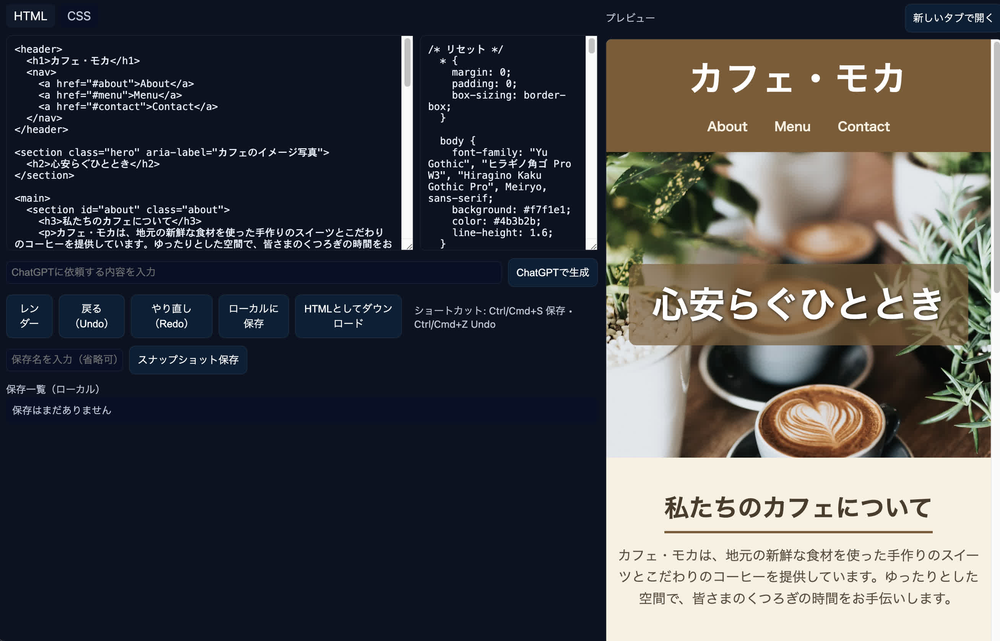

# gpt html editor

Execute = $node bin/app.js

Default access = http://localhost:3000

Default api access = http://localhost:8080

Setting file = ./etc/config.json

App page file = ./www/index.ejs

**Set up gpt key to ./etc/config.json**

"GPT": { "key": "" }    //set to API key

